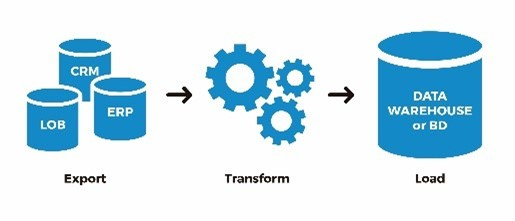
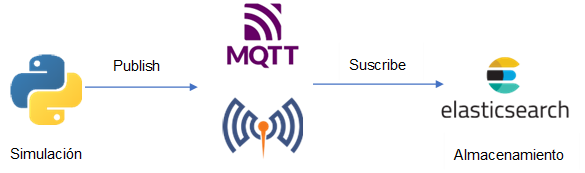
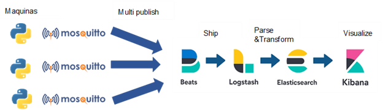
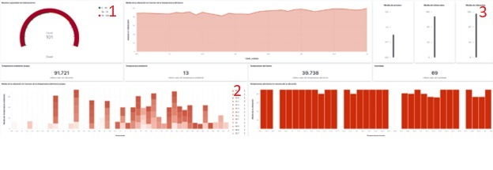

# Captura de datos mediante IoT

A la hora de extraer datos mediante diferentes dispositivos para después darles valor, hay que tener en cuenta que con un proceso bien estructurado y efectivo de **ETL (Extract-Transform-Load)** se puede optimizar el envío de datos derivados del Internet de las cosas

<figure><figcaption>
Proceso IoT (Internet of Things)
</figcaption></figure>

El **IoT** se define como la interconexión entre objetos cotidianos e internet, por lo que lo que puede aportar un gran número de beneficios que se desarrollaran más adelante

Sin embargo, en este caso no se requerirá de **SOTA** (_SW update over the air_) principalmente debido a que como es una simulación que se va a dar a cabo en un breve momento, no es necesario mejorar la **estabilidad** del software o **compatibilidad** del hardware, así como prevenirse de ciberataques.&#x20;

En este caso se ha simulado el funcionamiento de diversos **sensores** que suelen estar implementados en las máquinas de Cikautxo con el objetivo de poder saber a qué temperatura se realiza la pieza o diversos factores que pueden **alterar el estado del producto.**

Esta simulación se ha dado a cabo mediante un bucle en el que se generan datos **parcialmente** aleatorios. En él se encuentran 13 variables los cuales las podemos definir de la siguiente manera:

**Sensores:**

* **Fecha**: Momento de la obtención de los datos
* **Temp\_horno**: Temperatura de la maquinaria
* **Presión**: Representa si hay presión o no
* **Humo**: Muestra indicios de humo
* **Infrarrojos**: Mide la radiación electromagnética representada en nm (Newton metro)
* **Vibración**: Mostrado en hercios con un rango estándar de 0,1-500Hz
* **Id\_imagen**: Identificador de la imagen tomada de los siguientes parámetros:
  * Cumple o no:
    * Gafas
    * Guantes
    * Chaleco
    * Casco
* **Temp\_ambiente**: Temperatura en la nave
* **Humedad**: Humedad en la nave

La obtención de los datos se define como parcialmente aleatoria debido a que el primer resultado condiciona a los demás. Esto es debido a que después de generar la primera medición de temperatura se obtiene una segunda **basada** en la anterior, es decir, si la primera da 20 grados, el segundo será los 20 grados **sumando o restando** (un _random_) una **variación aleatoria** entre 0 y 1 grados así le damos más realismo a los datos ya que de un momento a otro la temperatura no cambia 10 grados.&#x20;

Además, debido a que una subida de la temperatura corresponde a un nivel mayor de energía interna, debido a que hay una mayor vibración de los átomos y electromagnetismo. Por ello, si la temperatura sube la vibración e infrarrojos **también** y viceversa (están correlacionadas)

Por último, en la función están definidos los máximos y mínimos de cada variable mediante **condiciones** por si en algún momento el límite definido se sobrepasa por la variación añadida.

Dentro del proceso de extracción, transformación se conseguirán dos resultados de distinta manera, pero con el objetivo final igual, obtener los datos

<figure><figcaption>
Proceso ETL (Extract-Transform-Load)
</figcaption></figure>

## 1-Publish-Suscribe (paho client)

En este proceso, una vez se tiene la función generando datos, se realiza una conexión al bróker **MQTT**, un protocolo de publicación y suscripción. A grandes rasgos de lo que se encarga es de que en este caso mediante un archivo ._py_ se suscribe a un _topic_ (los datos del sensor) y el bróker se mantiene como un **intermediario** que manda la consulta a los datos generados por la maquina y los recibe a modo de documento. &#x20;

Por último, cabe destacar la utilización del nivel de calidad de servicio (**QoS**). Gracias a esto podemos definir la **garantía** de entrega del mensaje. En este caso como los datos son constantes cada poco tiempo, se decide utilizar el **nivel 1** ya que con el 0 existe el **riesgo** de que se pierdan datos y con el 2 se crea una **sobrecarga** importante, además, se tiene capacidad de manejar duplicados

**Metodología**

<figure><figcaption>
Metodología del funcionamiento de la parte publich-suscribe
</figcaption></figure>

### 2-Publish-Transform-Load-Visualize

Por otro lado, este proceso es lo mismo que el anterior, pero eliminando el cómo se hace el _suscribe_ y se sustituye por una serie de pasos para poder finalmente visualizar en Kibana.&#x20;

Una vez pasen por el **bróker** los distintos _publish,_ se dirigen mediante [Filebeat](https://www.elastic.co/es/beats/filebeat), el cual monitorea y recopila los registros a [Logstash](https://www.elastic.co/es/logstash/). Esta herramienta centraliza, transforma y almacena los datos de distintas fuentes. Además, existe dentro de un parámetro llamado _filter_ en el cual existe [Grok](https://www.elastic.co/guide/en/logstash/current/plugins-filters-grok.html), esto da la posibilidad de estructurar los datos por columnas. &#x20;

De ese modo, poder guardar de manera correcta en [Elasticsearch](https://www.elastic.co/es/logstash/). Un motor de búsqueda donde ya se tienen los datos listos y guardados para el último paso, la visualización. Esto se lleva a cabo de la mano de [Kibana](https://www.elastic.co/es/kibana/), un software para crear paneles de variedades de gráficos.&#x20;

**Metodología**

<figure><figcaption>
Metodología del funcionamiento de la parte publish-suscribe para varias maquinas
</figcaption></figure>

## 3-Visualización en tiempo real de los datos

Este apartado refleja los diferentes gráficos que forman una visualización de los datos producidos por las maquinas en tiempo real.&#x20;

De este modo, gracias al **monitoreo** de los datos producidos podemos establecer alertas por si las temperaturas son muy altas y en consecuencia **apagarlas** para que no surja ningún problema. Además, también sirven para dar una **visión general** al técnico que supervise el buen funcionamiento de las maquinas.&#x20;

El **cuadro de mando** al completo es el siguiente:

<figure><figcaption>
Conjunto de gráficos que monitorizan los datos
</figcaption></figure>

**Contador de todas las indexaciones realizadas (1)**

Representa un **medidor** del numero de **indexaciones** producidas hasta el momento. Esta aplicado a una escala pequeña por ello solo hay 100 pero el objetivo es ver cuando se esta ocupando el almacenamiento interno para poder cambiarlo y que no se colapse un dia por no haberlo hecho.

**Muestra una gráfica que compara la humedad con la temperatura ambiente y por temperatura de la máquina (2)**

El siguiente grafico representa la **humedad** por la **temperatura del horno** y descompuesto por la temperatura ambiente. De este modo podemos observar si realmente afectan las diferentes condiciones que hay entre si. En este caso se observa como un aumento de la temperatura ambiente suele suponer un aumento también de la temperatura del horno. Por ello en días muy calurosos hay que tener muy en cuenta en el lugar en el que se encuentre y que este correctamente **ventilado**.

**Muestra diferentes variables que representan media de temperatura ambiente, ultima temperatura ambiente, ultima temperatura del horno y ultimo valor de humedad (3)**

Además, también se muestran los **últimos valore**s en formato numérico de las **principales variables** que se pueden encontrar. El objetivo principal es el de si en algún momento dado salte algún valor muy inusual por ejemplo por un escape de gas, directamente se puedan observar esos valores de forma **clara.**

&#x20;

